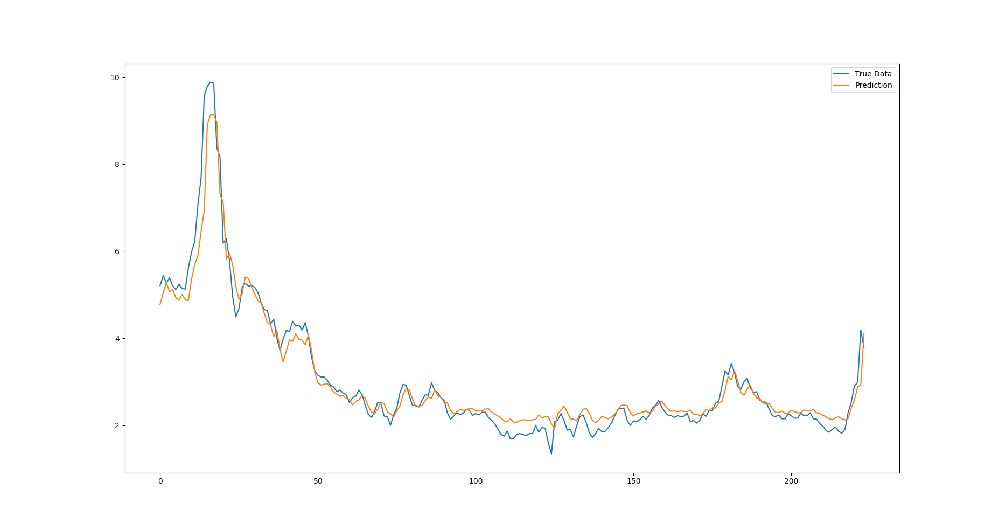

# Multilevel Wavelet Decomposition Network (Pytorch)
This project is the **pytorch** implementation version of Multilevel Wavelet Decomposition Network. 
[https://arxiv.org/abs/1806.08946](https://arxiv.org/abs/1806.08946)    
And the code is a simple implementation of the prediction task part(mLSTM) of the paper.
## Description
- The code simply implements twice wavelet decompositions,which can be further similarly expanded.
- The optimization part omits the use of mWDN for pre-training in the original paper.

## Requirements
- pytorch == 0.4.0
- python == 3.6

## Test Result Display
- Wavelet_LSTM : sequence_length=12, predict step=1 ,epochs=20,batch_size=32    

